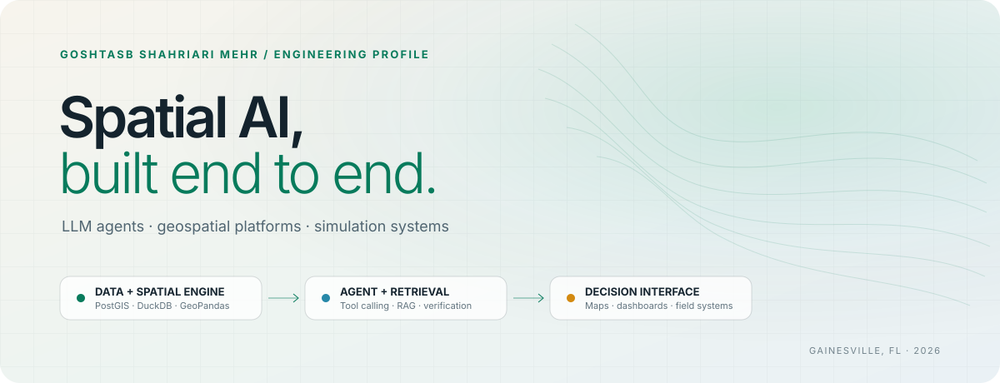
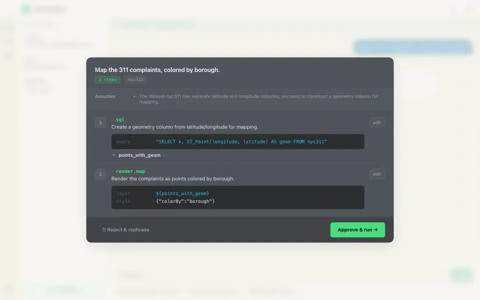
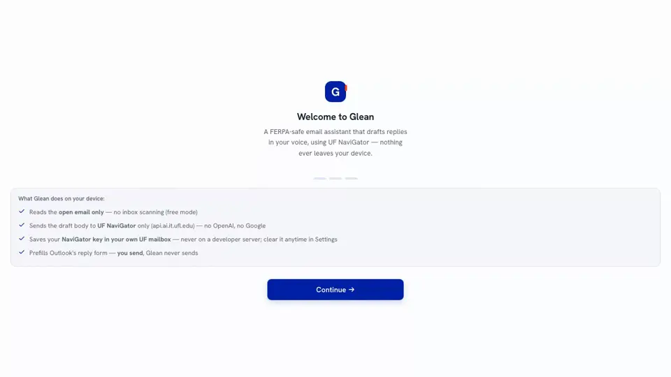
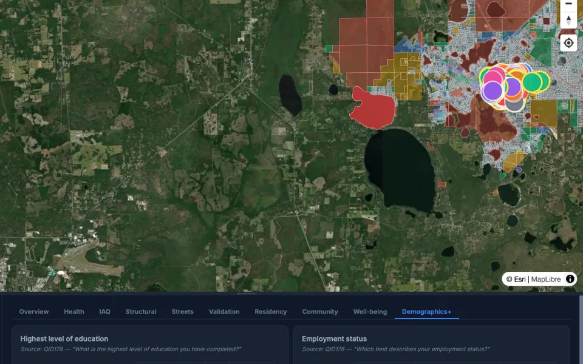
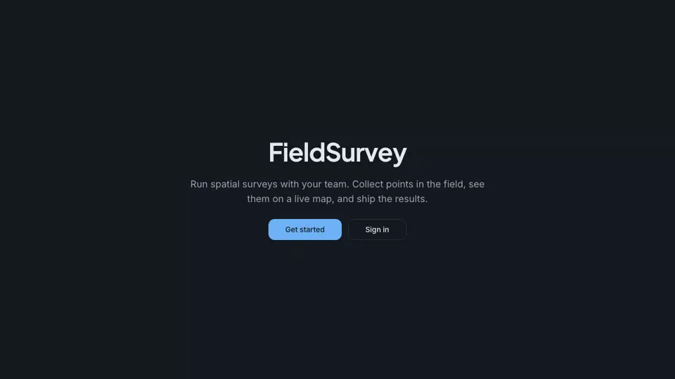
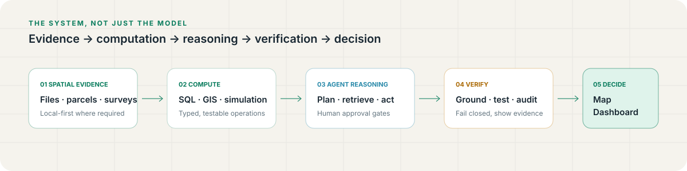

<picture>
  <source media="(prefers-color-scheme: dark)" srcset="./assets/hero-dark.svg">
  <source media="(prefers-color-scheme: light)" srcset="./assets/hero-light.svg">
  
</picture>

  <a href="https://goshtasbsh.github.io/"><strong>Portfolio</strong></a>&nbsp;&nbsp;·&nbsp;&nbsp;
  <a href="https://goshtasbsh.github.io/assets/cv.pdf"><strong>CV</strong></a>&nbsp;&nbsp;·&nbsp;&nbsp;
  <a href="https://www.linkedin.com/in/goshtasb-shahriari-mehr-1826bb130/"><strong>LinkedIn</strong></a>&nbsp;&nbsp;·&nbsp;&nbsp;
  <a href="https://scholar.google.com/citations?user=Bruj7TQAAAAJ&hl=en"><strong>Google Scholar</strong></a>&nbsp;&nbsp;·&nbsp;&nbsp;
  <a href="mailto:g.shahriarimehr@ufl.edu"><strong>Email</strong></a>

I am an **ML/AI engineer with a spatial systems background**. I build the full path from raw geographic evidence to a tested product: data pipelines, spatial computation, agent planning, retrieval, verification, APIs, and decision interfaces.

My Ph.D. dissertation at the University of Florida—successfully defended in August 2026—models urban food access with both calibrated rule-based agents and an LLM-driven generative twin. Alongside it, I earned an M.Sc. in Computer Engineering to bring modern ML, computer vision, and agent engineering into real spatial systems.

> **Current:** Research Assistant & Web Developer at UF's Shimberg Center for Housing Studies · Researcher with FIBER and the Disasters, Trust, and Social Change Lab · Gainesville, Florida

## Selected systems

<table>
  <tr>
    <td width="58%" valign="top">
      
      <h3>GeoChatBot</h3>
      
<strong>Browser-native agent for private spatial analysis.</strong> Files stay in the browser while an LLM plans and executes work through typed tools over DuckDB-WASM.

      
<code>23.4K TypeScript LOC</code> <code>800+ tests</code> <code>28 agent tools</code> <code>5 LLM providers</code>

      
<a href="https://geochatbot-eight.vercel.app/app"><strong>Live system ↗</strong></a> · <a href="https://github.com/GoshtasbSh/GeoChatBot">Source</a>

    </td>
    <td width="42%" valign="top">
      
      <h3>Local Glean</h3>
      
<strong>FERPA-sensitive AI email assistant.</strong> A self-hosted LangGraph pipeline triages mail and drafts grounded replies through an on-premise university LLM gateway.

      
<code>96.7% triage</code> <code>~660 tests</code> <code>~4 s median</code>

      
<a href="https://goshtasbsh.github.io/Glean_add-in/"><strong>Product brief ↗</strong></a> · <a href="https://github.com/GoshtasbSh/Glean_add-in">Source</a>

    </td>
  </tr>
  <tr>
    <td width="42%" valign="top">
      
      <h3>KeyStone Heights</h3>
      
<strong>Field research + geospatial intelligence.</strong> An offline survey PWA and live analytics environment serving a UF community-health study.

      
<code>11,319 parcels</code> <code>40+ RLS policies</code> <code>121 solo commits</code>

      
<a href="https://keystone-project-survey.vercel.app/static/index.html"><strong>Live platform ↗</strong></a> · <a href="https://github.com/GoshtasbSh/Keystone_Project_Survey">Source</a>

    </td>
    <td width="58%" valign="top">
      
      <h3>FieldSurvey</h3>
      
<strong>Multi-tenant spatial survey platform.</strong> Offline-first collection, PostGIS-backed data management, and a Python spatial-statistics engine behind a production map interface.

      
<code>~47K LOC</code> <code>258 solo commits</code> <code>60+ analyses</code>

      
<a href="https://fieldsurvey-alpha.vercel.app"><strong>Live alpha ↗</strong></a> · <a href="https://github.com/GoshtasbSh/fieldsurvey">Source</a>

    </td>
  </tr>
</table>

<strong>Open the engineering record: what these systems prove</strong>

 

| Capability | Evidence in shipped work |
|---|---|
| **Agent engineering** | Plan-then-execute control, human approval, 28 Zod-validated tools, critic loops, deterministic claim checks |
| **Retrieval** | Browser-side MiniLM embeddings, BM25, reciprocal-rank fusion, pgvector, episodic and social memory |
| **Spatial computation** | DuckDB-WASM, PostGIS, GeoPandas, PySAL, MapLibre, deck.gl, calibrated agent-based simulation |
| **Privacy and safety** | Zero-backend file analysis, on-prem model routing, prompt-injection defenses, fail-closed verification |
| **Product delivery** | React/Next.js, TypeScript, FastAPI, Supabase, offline PWAs, automated test and evaluation suites |

## How I build

<picture>
  <source media="(prefers-color-scheme: dark)" srcset="./assets/architecture-dark.svg">
  <source media="(prefers-color-scheme: light)" srcset="./assets/architecture-light.svg">
  
</picture>

I am most useful where **AI has to touch real data, real geography, and real operational constraints**. My default is not “add a chatbot.” It is to make the reasoning inspectable, keep computation deterministic where possible, measure failure modes, and expose the result through an interface people can actually use.

<strong>Explore the stack by layer</strong>

 

- **AI systems:** LLM agents, tool calling, LangGraph, structured output, RAG, evaluation harnesses, prompt-injection defense
- **ML and modeling:** PyTorch, scikit-learn, PyMC, Bayesian and causal inference, computer vision, Mesa-Geo, sensitivity analysis
- **Spatial:** PostGIS, GeoPandas, Shapely, PySAL/ESDA, DuckDB Spatial, MapLibre GL, deck.gl, H3
- **Product:** TypeScript, React, Next.js, Python, FastAPI, PostgreSQL, Supabase, Docker, Playwright

## Research translated into software

- **Urban Food Access ABM + Generative Twin** — approximately 48,000 synthetic households, four policy interventions, calibrated discrete-choice behavior, Monte Carlo runs, Sobol sensitivity analysis, and an LLM-agent twin with two-tier memory.
- **Three peer-reviewed publications** spanning location-based recommender systems, point-of-interest discovery, and tourism-experience analysis. [Read the publication record →](https://goshtasbsh.github.io/#publications)
- **Four degrees across spatial science, planning, and computer engineering**, including an M.Sc. in Computer Engineering from UF and a Ph.D. dissertation successfully defended in August 2026. [See the full path →](https://goshtasbsh.github.io/#education)

## Contact

I am open to engineering roles at the intersection of agentic AI, spatial data, simulation, and decision products.

  <a href="mailto:g.shahriarimehr@ufl.edu"><strong>Start a conversation →</strong></a>&nbsp;&nbsp;·&nbsp;&nbsp;
  <a href="https://goshtasbsh.github.io/"><strong>Review the full portfolio →</strong></a>&nbsp;&nbsp;·&nbsp;&nbsp;
  <a href="https://goshtasbsh.github.io/assets/cv.pdf"><strong>Download CV →</strong></a>

All project metrics above are drawn from the corresponding codebases and portfolio records. Private or research-sensitive systems are described without exposing restricted source or data.
